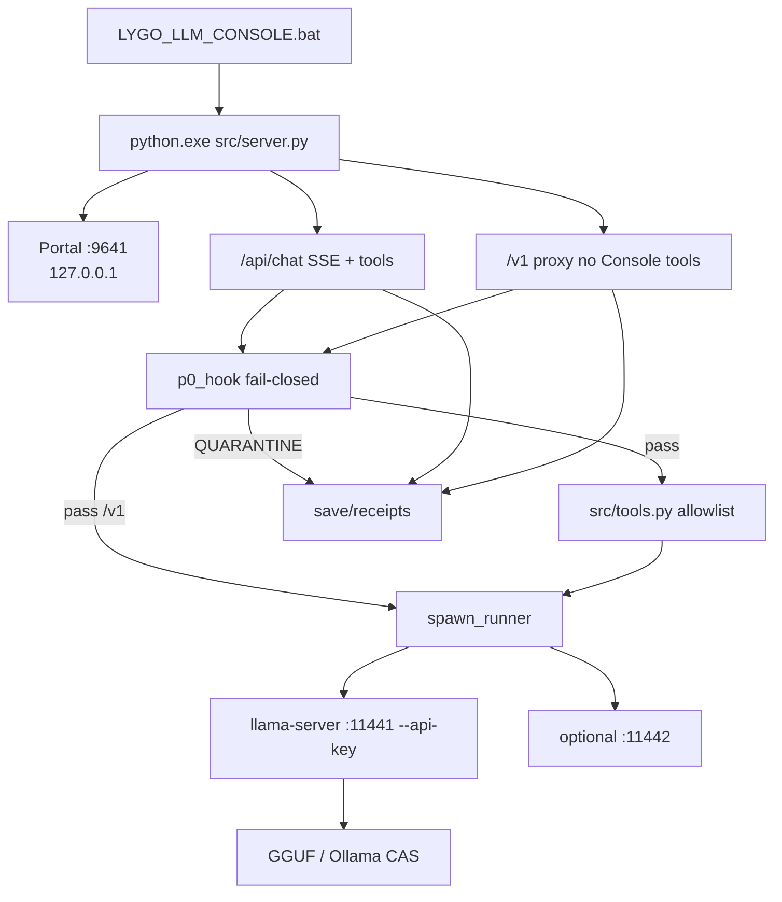
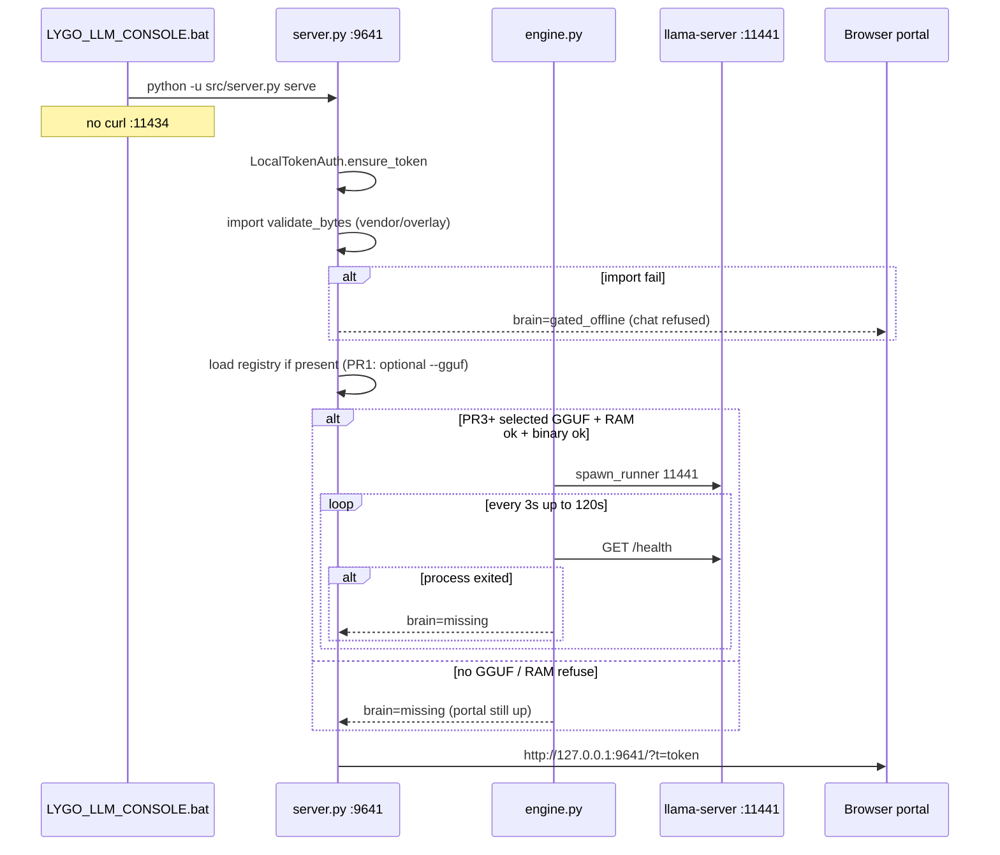

# LYGO LLM Console v1 — Design Document

| Field | Value |
|-------|--------|
| **Title** | LYGO LLM Console — sovereign local LLM runtime + agent portal |
| **Product name** | LYGO LLM Console |
| **Signature** | `Δ9Φ963-LYGO-LLM-CONSOLE-v1` |
| **Author** | Lightfather (steward) · design by Grok (RESOURCE, not CANON) |
| **Date** | 2026-09-15 |
| **Status** | Approved (design review 0 open issues, 2026-09-15) |
| **Git source of truth** | `I:\E Drive\lygo-protocol-stack\lygo_llm_console\` |
| **Whitepaper (ship with PR1)** | `I:\E Drive\lygo-protocol-stack\docs\whitepapers\LYGO_LLM_CONSOLE_v1.md` |
| **Runtime tree (stream node)** | `U:\LYGO\projects\lygo-llm\` ≡ `F:\LYGO\projects\lygo-llm\` |
| **Public origin** | https://github.com/DeepSeekOracle/lygo-protocol-stack.git (not fetched at review; treat as intended origin) |
| **Audience** | Senior engineers who already know this lattice |

Doctrine in this document: dual ledgers / Star Chart remain **CANON**. Grokipedia is **RESOURCE, not CANON**. Hub never replace/delete CANON. Lightfather is steward/playable — no identity replacement. Original Haven crafts only.

---

## Overview

Smart Disk Agent (`lygo_smart_disk/`, portal `:9631`) and stream-node CLAW (`U:\LYGO\projects\claw\lygo_node_server.py`, bind `0.0.0.0:9631`) already give LYGO a local agent surface — but both **delegate math to host Ollama on `127.0.0.1:11434`**. Ollama itself is an orchestrator: `NewLlamaServer` spawns **upstream `llama-server`**, stores GGUF as content-addressed blobs under `models/blobs/sha256-*` plus Docker-like manifests. The steward already has those blobs at `U:\LYGO\models` (`llama3.1:8b`, `qwen2.5:3b`, `nomic-embed-text`). Depending on `ollama.exe` is the opposite of a sovereign runtime.

**LYGO LLM Console** is a Windows-first, double-click product that **does not call `ollama.exe`**. It vendors official **ggml-org llama.cpp** Windows binaries (`llama-server.exe` + CPU/Vulkan DLLs) under `engine/`, scans disk for GGUF (and read-only Ollama CAS trees), registers models, boots a **private** `llama-server` on `127.0.0.1:11441`, and serves a single-page agent portal on **`127.0.0.1:9641`**. Every generation runs a **vendored** copy of the canonical P0 Φ-gate (`validate_bytes`) plus a **new** allowlisted tool loop (not a copy of stream CLAW). An OpenAI-compatible proxy (`POST /v1/chat/completions`) lets other local apps talk to the Console instead of Ollama.

**Staff slice:** PR1–PR3 on GamePC are the first implementable cut (whitepaper + HTTP skeleton + scanner + real supervisor hello-chat). PR4–PR9 complete v1 (proxy, tools, receipts, embed, mmproj, stream drop). Do not claim nine PRs plus soak in one calendar week.

Inference is GGUF / mmproj / embedding GGUF only. HuggingFace safetensors (including `I:\DeepSeek-V4.1-Flash`, 48 shards) are **cataloged as `UNSUPPORTED_FORMAT`**, never pretended to run on 16 GB Vega. `convert.py` RAM-OOM on this hardware is **steward-reported**, not re-measured in this review.

---

## Background & Motivation

### Current state (pain)

| Surface | What it is | Dependency |
|---------|------------|------------|
| Stream node CLAW | `U:\LYGO\projects\claw\lygo_node_server.py` + `lygo_usb_agent_tools.py` | `OLLAMA_HOST=127.0.0.1:11434` |
| Smart Disk Agent | `lygo_smart_disk/agent/smart_disk_agent.py` `OllamaClient` | `http://localhost:11434` `/api/tags` `/api/chat` |
| LYGO High-Perf | `lygo_highperf/scripts/03_boot_llamacpp.ps1` | Already llama.cpp, but GamePC/CUDA path (`:8000`), not the stream node product |
| Host Ollama | `U:\LYGO\projects\ollama\ollama.exe` | Nested `lib/ollama/llama-server.exe` — **do not reuse** (file **is** on disk) |

`lygo_smart_disk/config/smart_disk.json` binds `localhost:9631` and sets `"kill_host_ollama": false`. `U:\LYGO\bin\start-all.ps1` **always** starts Ollama `:11434`, Gitea `:3001`, Caddy `:8080`, CLAW `:9631`. Watchdog (`U:\LYGO\README.txt`) re-runs `start-all.ps1` if those ports are down. There is **no free LYGO-owned inference control plane**. Console ports 9641 / 11441 / 11442 are unused on the stream tree.

### Why not fork Ollama

Ollama is a Go daemon + CLI + registry:

- HTTP: `/api/generate`, `/api/chat`, `/api/tags`, `/api/pull`, `/api/create`, blob store
- CAS: `~/.ollama/models/blobs/sha256-*` + `manifests/registry.ollama.ai/library/<name>/<tag>`
- Manifest v2 layers: model GGUF, projector, adapter, template, params, system, license (not every tag has every layer — see import schema below)
- Scheduler → **runner subprocess**
- Current path: **all GGUF served via upstream llama-server**; older cgo `llamarunner` / ggml `ollamarunner` / Apple MLX exist
- Modelfile = Docker-like recipe (`FROM`, `TEMPLATE`, `SYSTEM`, `PARAMETER`, `ADAPTER`)

llama.cpp (ggml-org) **is** the inference engine:

- `llama-server`: OpenAI `/v1/chat/completions`, `/v1/completions`, `/v1/embeddings`
- Tools via `--jinja` (Llama 3.1, Qwen 2.5, Hermes, Mistral, generic)
- Multimodal: `--mmproj` GGUF; OpenAI content parts
- Multi-model router / LRU exists upstream (exact “2025-12+” flag set **not verified** against current ggml-org releases — v1 does not use it)
- Windows backends: CPU, CUDA, Vulkan

Forking Ollama would import Go, a registry protocol, and a subprocess model we already get from llama.cpp. **We orchestrate llama.cpp ourselves**, with LYGO P0–P9 on the control plane.

Optional: **read-only import** of an existing Ollama blob/manifest tree as GGUF sources (same idea as `lygo_highperf/scripts/01_stage_models.ps1` `Get-OllamaModelBlob` / `Link-Gguf`, but in Python). **Never** inherit that script’s fallback `ollama show … --modelfile` — that executes `ollama.exe`.

### Hardware reality

| Box | Role | Constraint |
|-----|------|------------|
| GamePC | Design/code | Windows, 32 GB RAM; may also run High-Perf `:8000` |
| Stream PC `DESKTOP-GGC3TU6` | Always-on host | Win10 Home, Ryzen 5 3400G **4c/8t**, **16 GB RAM**, Vega iGPU, `F:\` ~1.4 TB (`U:\LYGO` from GamePC). OBS lives here. Host Ollama is **always started**. |
| DeepSeek-V4.1-Flash | Archive only | `I:\DeepSeek-V4.1-Flash` has `model.safetensors.index.json` + `model-00001-of-00048.safetensors` … `00048` |

**On-disk stream CAS (verified):**

| Tag | Model blob | Bytes | SI / IEC | Extra layers |
|-----|------------|-------|----------|--------------|
| `qwen2.5:3b` | `sha256-5ee4f07c…` | 1 929 903 008 | **1.93 GB / 1.80 GiB** | `.system` `.template` `.license` — **no `.params`** |
| `llama3.1:8b` | `sha256-667b0c19…` | 4 920 738 944 | 4.92 GB / 4.58 GiB | `.template` `.license` `.params` — **no `.system`** |
| `nomic-embed-text:latest` | `sha256-970aa74c…` | 274 290 656 | 274 MB | `.license` `.params` |

**RAM honesty:** `start-all.ps1` keeps Ollama resident. Console spawn is a **second** runtime. 8B is **not** “loadable if OBS idle” while Ollama also holds 8B. Default chat = qwen2.5:3b. Before spawn, refuse if available physical RAM `< model_bytes + 2 GiB`. Operators may `ollama stop llama3.1:8b` (unload weights, **do not** `taskkill ollama.exe`) during Console soak.

**Performance targets (v1 contracts):**

- Scan 1 TB of GGUF **headers only** (≤ 1 MiB read per file) in **< 30 s** wall on stream node HDD/SSD mix.
- First token, Qwen2.5 3B Q4, 16 GB APU: **CPU-bound**. Default **`n_gpu_layers=0`**, **`-t 4`**, **`-np 1`**, **`-c 4096`** (cap 8192). Do not promise GPU tok/s until measured.
- Soak README must record: prompt text, `max_tokens`, OBS on/off, `ollama_port_open`, llama-server RSS, avail RAM before/after, `first_token_ms`. Suggested soak prompt: `"Say LYGO_OK"` / `max_tokens=32`.

### Existing LYGO functions this product must cite (not reinvent)

| Layer | Real code | Console use |
|-------|-----------|-------------|
| P0 physics | `byte_entropy_filter.validate_bytes` (`MAX_BYTES=8192`, `PHI_MIN=0.618`, `PHI_MAX=1.618`) | **Vendored** under `src/vendor/p0/`; hard-stop on `QUARANTINE`. CANON remains the stack file. |
| P0 shim | `lygo_p0.py` re-exports the filter; `stack/kernel_bridge.py` `NanoKernelBridge.validate` | Hot path does **not** import `kernel_bridge` or `LYGOProtocolStack` |
| P0 policy (SDA) | `lygo_smart_disk/kernel/p0_gate.py` `P0Gate.validate` regex + **12000** char cap + `high_entropy_blob` | Reimplement in `p0_hook.py` (do not import SDA package — may be absent on stream runtime) |
| P0 honesty | `docs/P0_HONEST_SPEC.md` | Do **not** claim entropy = ethics |
| Stack | `stack/lygo_stack.py` `deploy_stack()` / `LYGOProtocolStack.demo_cycle()` | `stack_health` **subprocess only**; optional; missing stack ≠ chat failure |
| P3 | SDA `P3Consensus.achieve` (identity stub). `VortexConsensusSync.vortex_signature` is an **instance** method (`kernel`, `mycelium`, `sovereign_id`) | Copy the ~15-line hash-reduce into `p3_note.py`. Do **not** construct `VortexConsensusSync` on the hot path |
| P1 | SDA `P1Memory.store` JSONL `{id, ts, bundle}` | `save/mycelium/events.jsonl` — wrap receipt metadata as `bundle` |
| P5 | SDA `P5Identity.create_node` light_code | Copy the same algorithm into `receipts.py` (`create_node("chat")`). Do not import `lygo_smart_disk` |
| Equation exchange | `tools/run_equation_exchange.py` (`eta`, `C`, `gamma_Q`, Φ thresholds) | RESOURCE citation; v1 does not dual-sample |
| USB tools | Public kit vs stream **admin** stick are **different files** | **Spirit only.** New `src/tools.py`. **Forbid** importing either `lygo_usb_agent_tools.py` |
| HTTP pattern | `SmartDiskAgent` + `ThreadingHTTPServer`; `/static/` → `portal/` | Copy server + static rewrite; **do not** copy Ollama curl from `LYGO_SMART_DISK_BOOT.bat` |
| Auth | `lygo_smart_disk/agent/auth.py` `LocalTokenAuth` | Same local-token model, header `X-LYGO-LLM-Token` |
| Consent | stack-wide `--i-consent` | LAN, extra roots, hardlinks, `save_full_prompts` |

---

## Goals & Non-Goals

### Goals (v1 ships)

1. Double-click `LYGO_LLM_CONSOLE.bat` on Windows starts a Python stdlib HTTP server and opens the portal.
2. Serve a single-page agent portal (HTML/CSS/JS, **no npm build**).
3. Scan configured roots for `*.gguf` **and** Ollama blob+manifest trees (read-only, **no** `ollama` CLI).
4. Register models: name, path, kind `chat|embed|mmproj`, ctx, gpu layers.
5. Boot vendored `llama-server.exe` for the selected GGUF on **`127.0.0.1:11441`**.
6. Chat UI: streaming text, image attach if mmproj registered, tool-calling loop on **`/api/chat` only**.
7. Built-in allowlisted tools (no `run_cmd`): `list_dir`, `read_file`, `write_file`, `remember`, `kernel_status`, `search_corpus`, `p0_gate`, `stack_health`. **Refuse** OS-wipe / `format c:` / `diskpart`. Public **READ_ROOTS = `workspace`**; **WRITE_ROOTS = `workspace` + `save`** (secrets under kit `data/` and `save/logs` still denied).
8. Every generation: P0 Φ-gate (fail-closed if `validate_bytes` missing) + policy gate on **input and streamed output**; optional P3 note; alignment receipt JSON under `save/receipts/`.
9. OpenAI-compatible proxy: `POST /v1/chat/completions` (P0 + forward, **no Console tool execution**), plus `/v1/models`, `/v1/embeddings`.
10. Offline-first. No required cloud. HuggingFace download is **out of v1**.

### Non-goals (v1)

- Not an Ollama fork; no Modelfile compiler; no `/api/pull` registry; no `ollama show`.
- Do not exec `ollama.exe` or load `U:\LYGO\projects\ollama\lib\ollama\llama-server.exe`.
- Do not run HuggingFace safetensors / DeepSeek-V4.1-Flash.
- Do not replace Smart Disk (`:9631`) or CLAW; Console is a **sibling** on `:9641`.
- Do not bind LAN by default (CLAW already occupies `0.0.0.0:9631`).
- Do not commit vaults, `I:\LYGO_SERVER_KEYS`, Gitea passwords, steward write-roots, or V4.1 weights.
- Do not dump this UI into `D:\chatagent` Crypt `game.js`.
- No npm, no pip-mandatory deps, no Docker, no cloud auth.
- No identity replacement; no Hub overwrite of CANON.
- `run_cmd` / PowerShell is **not in public source at all** (not even stubbed).
- Do not import stream `U:\LYGO\projects\claw\lygo_usb_agent_tools.py` or public USB tools module.

---

## Key Decisions

1. **Not an Ollama fork; orchestrate ggml-org `llama-server`.**  
   Ollama is a registry + subprocess supervisor. llama.cpp is the math. Reuse Ollama only as a **read-only GGUF source** (manifest JSON + blob peek). Never `ollama` CLI.

2. **Never call `ollama.exe`. Never vendor Ollama’s nested `lib/ollama/` copy.**  
   That nested tree **exists** (`U:\LYGO\projects\ollama\lib\ollama\llama-server.exe` + CUDA/Vulkan DLLs). Engine = official ggml-org Windows zip **or** LYGO-owned cache `U:\LYGO\projects\lygo-llm\engine\`. Unit-test refuse if resolved path contains `projects\ollama\lib\ollama`.

3. **Ports: UI/agent `9641`, llama-server `11441`, embed `11442`.**  
   Occupied: CLAW/SDA `9631`, Ollama `11434`, Gitea `3001`, Caddy `8080`, High-Perf `8000`. Collision is a product bug.

4. **Bind `127.0.0.1` by default; LAN is an explicit flag.**  
   `--lan` / `LYGO_LLM_BIND=0.0.0.0` requires `--i-consent` and `auth.required=true`. Caddy `/llm*` is **not** v1.

5. **Single active chat runner in v1.**  
   Switching models restarts the chat runner. Embed runner is a second process via the same `spawn_runner(port, gguf, kind)` (PR3 lands the function; PR7 uses it). Idle-timeout 120 s on embed.

6. **Default ngl=0; no flash-attn flag in v1.**  
   `-t 4` (leave 4 SMT threads for OBS/Windows), `-np 1`, `-c` default 4096, max 8192 on 16 GB. No `-fa` until a measured Vulkan/CPU receipt exists. CUDA zip is not the stream default.

7. **Default chat model = `qwen2.5:3b` (1.80 GiB blob).**  
   8B is opt-in and will usually fail the RAM check while host Ollama is warm.

8. **Python stdlib only for the Console process.**  
   Stream embed `U:\LYGO\projects\python\python.exe` (3.12; `python312._pth` has `import site` and `.` — stdlib HTTP works). GamePC `C:\Python313`. No pip.

9. **P0 is two stacked gates, honestly named, fail-closed.**  
   - **Physics:** vendored `validate_bytes`. Window = first 8192 **bytes** of the new user turn (and inbound tool-arg JSON). Truncation sets `p0_truncated`; truncation **alone** is not QUARANTINE.  
   - **Policy:** full **text** (not windowed), cap **12000 chars** (SDA `_MAX_CHARS`). Prompt/output policy is **SDA `P0Gate` regex** (`format\s+c:`, `rm\s+-rf\s+/`, harm, jailbreak, `mimikatz`, …) plus **command-like wipe tokens** as their own patterns (`diskpart`, `bcdedit`, `cipher /w`, `\bshutdown\b`) plus SDA `high_entropy_blob`. **Do not** apply USB `DENY_CMD` wholesale to prompts — that tuple is for `run_cmd` only (which v1 does not ship), and `"format "` would QUARANTINE the required ALLOW case `"format a string"`. Contract: `format c:` QUARANTINE; `"format a string"` ALLOW/AMPLIFY. Same policy regex on **streamed model output** (512-char windows + full assistant at end).  
   Chat **refuses** if `validate_bytes` cannot be imported. Entropy is not ethics.

10. **P3 is a note, not a veto.**  
    Receipts call a **local** `vortex_signature(data: str)` copied from `lygo_p3.py` (SHA-256 → digit 1–9 + hex coord). Also record SDA-shaped `{consensus_found: true, mode: "single_agent_identity"}`. Do not instantiate `VortexConsensusSync` during chat.

11. **New `src/tools.py` — do not mirror USB modules.**  
    Canonical OpenAI names: `list_dir`, `read_file`, `write_file`, `remember`, `kernel_status`, `search_corpus`, `p0_gate`, `stack_health`. Aliases `read`→`read_file`, `write`→`write_file` in `dispatch` only. **No `run_cmd`.** Public **READ_ROOTS = `{workspace}`** (receipts via `/api/receipts`, not raw `save/`). Public **WRITE_ROOTS = `{workspace, save}`**. Steward `local.json` may widen roots only with `--i-consent`. **Non-overridable deny** (substring, even under KIT_ROOT / extra roots): `I:\LYGO_SERVER_KEYS`, `gitea.pass`, `.lygo_llm_token`, `.llama_api_key`, `save/logs`, `engine.pid.json`, `projects\gitea\home`, `C:\Windows`, `C:\Program Files`, `Data Vault`. `kernel_status` and `/api/health` must not echo the llama api-key. Tests: `read_file` on `data/.llama_api_key` denied; public `tools.py` source must not contain `LYGO_SERVER_KEYS`, `Data Vault`, `C:\\Users\\justi`, or `run_cmd`.

12. **Split HTTP dialects.**  
    `/api/chat` = P0 + optional Console tools + documented SSE JSON lines. `/v1/*` = P0 + forward to llama-server **without** injecting Console tools; client-supplied `tools` are forwarded but **not executed** by Console. Default `max_tokens=512`.

13. **Safetensors/HF = `UNSUPPORTED_FORMAT`.**  
    Including `I:\DeepSeek-V4.1-Flash`.

14. **Git vs runtime split.**  
    Public source under `lygo-protocol-stack/lygo_llm_console/` (hyphen). Runtime+engine+receipts on `U:\LYGO\projects\lygo-llm\`. Sync is copy, not “commit the stream disk.”

15. **Local operator token, not a cloud password.**  
    Clone `LocalTokenAuth`: `data/.lygo_llm_token`, header `X-LYGO-LLM-Token`, boot URL `?t=` stripped by portal.

16. **Receipts store hashes, not prompt plaintext.**  
    `P5Identity.create_node("chat")` algorithm for `light_code`. Mycelium row = `{id, ts, bundle}` wrapping receipt metadata.

17. **Consent-gated writes / LAN / extra roots.**  
    Expanding read/write-roots or `--lan`: `--i-consent` or UI confirm → `save/consent.json`.

18. **Do not kill host Ollama. Do account for it.**  
    Informational `ollama_port_open` on `/api/health`. RAM check before spawn. Suggest `ollama stop <large>` during soak. Never `taskkill ollama.exe`.

19. **Vendor P0 physics into the product tree (PR1).**  
    Stream runtime has **no** protocol-stack checkout (only `U:\LYGO\save\git\lygo-protocol-stack\` bare mirror). Copy **only** `byte_entropy_filter.py` to `src/vendor/p0/`. Import: try stack overlay if `LYGO_STACK_ROOT` has the file; on `ImportError` insert vendor and retry; only then `PHYSICS_AVAILABLE=False`. Fail-closed after both attempts.

20. **llama-server `--api-key` is internal.**  
    Console generates a random key, passes `--api-key` to the child, and only the proxy knows it. `/api/health` and `kernel_status` must **not** print the key. Tool `read_file` cannot open `data/.llama_api_key`. Loopback clients that skip `:9641` get 401 from llama-server.

21. **Port-scoped process control, never `Get-Process llama-server`.**  
    `CREATE_NEW_PROCESS_GROUP` + Job Object when ctypes works. STOP bat kills listeners on **11441/11442 only**. High-Perf `99_stop.ps1` is name-based and **will murder Console’s llama-server** if both run on GamePC — out of v1 to fix High-Perf; document the collision.

---

## Proposed Design

### Placement

```
Git (no vaults, no engine blobs):
  I:\E Drive\lygo-protocol-stack\
    lygo_llm_console\                 # product source
    docs\whitepapers\LYGO_LLM_CONSOLE_v1.md

Runtime (stream node canonical):
  U:\LYGO\projects\lygo-llm\          # = F:\LYGO\projects\lygo-llm
    engine\                           # llama-server.exe + DLLs (not git)
    models\                           # optional hardlinks to GGUF
    config\local.json                 # gitignored steward roots
    save\receipts\
    save\logs\
    data\.lygo_llm_token
```

Python discovery order in `LYGO_LLM_CONSOLE.bat` (no Ollama curl, no `:11434` probe):

1. `%LYGO_PYTHON%`
2. `U:\LYGO\projects\python\python.exe` / `F:\LYGO\projects\python\python.exe`
3. `C:\Python313\python.exe`
4. `py -3.12` / `python`

### Directory map (git)

```
lygo_llm_console/
  README.md
  LYGO_LLM_CONSOLE.bat
  LYGO_LLM_CONSOLE_STOP.bat
  config/
    console.json
    local.json.example
  engine/
    README.md                    # pinned tag placeholder; binaries gitignored
  scripts/
    fetch_engine.ps1             # optional; pinned tag; CPU zip regex only
  portal/
    index.html                   # href=/static/style.css  src=/static/app.js
    app.js
    style.css
  src/
    vendor/p0/
      byte_entropy_filter.py     # copy of CANON; comment points at stack path
      NOTICE.txt
    paths.py
    server.py
    auth.py
    scanner.py
    gguf_header.py
    ollama_import.py
    registry.py
    engine.py                    # spawn_runner(port, gguf, kind, **kw)
    openai_proxy.py              # PR4
    chat_loop.py                 # PR4/PR5
    p0_hook.py
    p3_note.py
    receipts.py
    tools.py                     # written here; never import USB modules
    stack_health.py
  tests/
    test_scanner.py
    test_registry.py
    test_p0_hook.py
    test_openai_proxy.py         # PR4
    test_tools.py                # includes source-text forbid list
    test_engine.py
    fixtures/
      tiny.gguf                  # GGUF v3, tensor_count=0, two KV (see below)
      ollama_tree/               # fake CAS for tests
  workspace/
  save/
    receipts/
    mycelium/
```

### Process model



CLAW `:9631` and Ollama `:11434` stay up. Console never `taskkill` them.

### Boot sequence



Stop: `POST /api/shutdown` (token) → `TerminateJobObject` or terminate **recorded PIDs**; STOP.bat uses `Get-NetTCPConnection -LocalPort 11441,11442` — **not** `Get-Process llama-server`.

### Engine supervisor

`src/engine.py` public API (land in **PR3**, used by PR7):

```python
def spawn_runner(*, port: int, gguf: Path, kind: str, mmproj: Path | None,
                 ctx: int, ngl: int, alias: str, api_key: str) -> Runner:
    ...

def stop_runner(runner: Runner, timeout_s: float = 8.0) -> None: ...
def available_ram_bytes() -> int: ...  # ctypes GlobalMemoryStatusEx
def ram_ok(model_bytes: int, headroom: int = 2 * 1024**3) -> bool: ...
def binary_forbidden(path: Path) -> bool:
    return "projects\\ollama\\lib\\ollama" in str(path).replace("/", "\\").lower()
```

**Frozen argv (v1):**

```text
llama-server.exe
  -m <gguf>
  [--mmproj <mmproj>]          # only if kind=chat and mmproj set
  --host 127.0.0.1
  --port <11441|11442>
  -c <ctx>                     # default 4096; min(requested, ctx_max=8192)
  -ngl <ngl>                   # default 0
  -t 4
  -np 1
  --jinja
  --metrics
  --alias <registry id>
  --api-key <internal>
```

No `-fa`. No `--models-dir` router.

**Windows process contract:**

```python
CREATE_NEW_PROCESS_GROUP = 0x00000200
CREATE_NO_WINDOW = 0x08000000
proc = subprocess.Popen(
    argv,
    cwd=str(engine_dir),
    env=clean_env,
    stdout=log_f, stderr=err_f,
    creationflags=CREATE_NEW_PROCESS_GROUP | CREATE_NO_WINDOW,
)
# Best-effort Job Object (kernel32 CreateJobObjectW / AssignProcessToJobObject /
# JOB_OBJECT_LIMIT_KILL_ON_JOB_CLOSE). If ctypes fails, still track PID.
```

Kill: CTRL_BREAK to that process group, wait, then `terminate`. Job close kills orphans if assigned.

**Env overlay (`clean_env`):** copy `os.environ`, then **delete** every key starting with `OLLAMA_` or `LLAMA_ARG_`. Do not set High-Perf `LLAMA_ARG_CHAT_TEMPLATE_KWARGS` unless Console config explicitly does.

**Health loop:** every **3 s**, up to **120 s**: if `proc.poll() is not None` → fail with exit code; else `GET http://127.0.0.1:<port>/health` (llama-server native). Fallback `GET /v1/models` with `Authorization: Bearer <internal key>` if `/health` 404 on older binaries.

**RAM gate:** `GlobalMemoryStatusEx` → `ullAvailPhys`. If `ullAvailPhys < model_stat_size + 2 GiB` → do not spawn; `/api/health` `brain=ram_refused` with numbers. UI can still scan/register.

**Binary resolve:** `engine/llama-server.exe` next to product, else `U:\LYGO\projects\lygo-llm\engine\llama-server.exe`. Refuse forbidden path even if on PATH.

**Optional fetch (`scripts/fetch_engine.ps1`):** do **not** copy High-Perf CUDA `releases/latest` script as-is.

- User-Agent `LYGO-LLM-CONSOLE`
- Repo `ggerganov/llama.cpp` (ggml-org)
- **Pinned tag** in `engine/README.md` (fill after **one successful GamePC fetch**; until then placeholder `PIN_AFTER_FETCH`)
- Asset regex **only**: `^llama-.*-bin-win-cpu-x64\.zip$` (optional second script/flag for `win-vulkan`)
- Never `*-cuda-*` on stream default
- Offline-first: boot does not fetch

**Mutex:** one `threading.Lock` (`ENGINE_LOCK`) covering stop+start+in-flight generation. Model switch waits for the current stream to finish or cancel (client disconnect closes upstream HTTP). No overlapping `spawn_runner` for the chat port.

### GGUF header parser (implementable)

File `src/gguf_header.py`. Read **at most 1 048 576 bytes**. Never seek tensor data beyond that buffer.

**Layout (little-endian):**

| Offset | Field | Type |
|--------|-------|------|
| 0 | magic | 4 bytes `GGUF` (`47 47 55 46`) |
| 4 | version | `uint32` — accept **1, 2, 3**; reject others as `UNSUPPORTED_FORMAT` |
| 8 | tensor_count | `uint64` |
| 16 | kv_count | `uint64` |
| 24 | KV stream | see types |

**GGUF value types:** `UINT8=0 INT8=1 UINT16=2 INT16=3 UINT32=4 INT32=5 FLOAT32=6 BOOL=7 STRING=8 ARRAY=9 UINT64=10 INT64=11 FLOAT64=12`.

**STRING:** `uint64 length` + `length` bytes (no NUL). **ARRAY:** `uint32 etype` + `uint64 count` + packed elements of `etype`. **KV stream is packed little-endian** — do **not** 32-byte-align between keys. In ggml, 32-byte alignment applies to **tensor data after** the metadata blob. v1 never reads tensor data, so never insert padding in the KV walker. Skip ARRAY by walking `etype`/`count`/elements until the value is consumed or the 1 MiB buffer ends (`meta_truncated`). If a read would exceed the buffer, stop.

**Algorithm:**

```
buf = file.read(1048576)
if buf[:4] != b"GGUF": → not_gguf
ver, n_tensors, n_kv = parse header
pos = 24
found = {}
for i in 0..n_kv:
    if remaining < 8: meta_truncated=true; break
    key = read_string()
    typ = read_u32()
    val = skip_or_read_value(typ)   # skip ARRAY bodies except we never need them
    if key in {general.name, general.architecture, general.file_type}
       or key.endswith(".context_length"):
        found[key] = val
    if "general.name" in found and "general.architecture" in found
       and any(k.endswith(".context_length") for k in found):
        break   # stop early; tokenizer arrays may blow the 1 MiB window
register even if ctx missing: ctx_default from console.json (4096)
never map tensors
```

**Kind heuristic:** `embed` if architecture in `{nomic-bert, bert, jina-bert}` or name contains `embed`; `mmproj` if name/arch contains `mmproj` / `clip` projector; else `chat`.

**Safetensors:** `.safetensors` or sibling `model.safetensors.index.json` → `UNSUPPORTED_FORMAT` (no GGUF parse).

**Fixture `tests/fixtures/tiny.gguf` (GGUF v3):**

- magic `GGUF`, version `3`, tensor_count `0`, kv_count `2`
- `general.name` = STRING `"tiny"`
- `general.architecture` = STRING `"llama"`
- file size well under 1 KiB
- tests must assert `meta_truncated is false` and kind `chat`

Tokenizer-heavy real files may omit `*.context_length` in the 1 MiB window → `meta_truncated=true`, still register if magic + name or arch found, ctx = config default.

### Ollama CAS import

`src/ollama_import.py` — **read-only**, **never** subprocess `ollama`.

Manifests are **extensionless** files:

```
<models>/manifests/registry.ollama.ai/library/<name>/<tag>
```

JSON (verified):

```json
{
  "schemaVersion": 2,
  "mediaType": "application/vnd.docker.distribution.manifest.v2+json",
  "config": { "mediaType": "application/vnd.docker.container.image.v1+json", "digest": "sha256:…", "size": N },
  "layers": [
    { "mediaType": "application/vnd.ollama.image.<kind>", "digest": "sha256:<hex>", "size": N }
  ]
}
```

**Layer kinds to handle:** `model`, `projector`, `adapter`, `template`, `system`, `params`, `license`. Tags **omit** layers (qwen2.5:3b has no `params`; llama3.1:8b has no `system`). Missing kind = skip that sidecar, not a hard fail.

**Digest → blob path:** `digest.replace("sha256:", "sha256-")` joined to `<models>/blobs/<that>` — **no `.gguf` suffix**. Peek magic on the model/projector blob. If blob **missing**: record `status=blob_missing`, `runnable=false`, continue other manifests. Do **not** call `ollama show`.

**Display id:** last two path parts `library/<name>/<tag>` → **`name:tag`** (e.g. `qwen2.5:3b`, not `library/qwen2.5:3b`). Matches SDA primary.

Walk: `*/manifests/registry.ollama.ai/**` and `*/manifests/registry.hf.co/**` if present. Sidecar text layers: read if `size ≤ 256 KiB`.

Optional hardlink into runtime `models/` behind `--i-consent` only.

**Tests:** fixture tree with qwen manifest JSON + a fake `blobs/sha256-5ee4f07c…` file containing **only** GGUF magic (tiny.gguf copy). Assert registry id `qwen2.5:3b`. Second case: manifest pointing at absent blob → `blob_missing`.

Default **public** scan roots:

```json
"scan_roots": ["./models", "%USERPROFILE%/.ollama/models"]
```

Steward `config/local.json` (gitignored):

```json
"scan_roots": ["U:/LYGO/models", "U:/LYGO/projects/lygo-llm/models"]
```

Do **not** default `I:\LYGO_SERVER_KEYS`, USB vaults, or `I:\DeepSeek-V4.1-Flash`. If the operator adds DeepSeek:

```json
{
  "name": "DeepSeek-V4.1-Flash",
  "kind": "archive",
  "status": "UNSUPPORTED_FORMAT",
  "reason": "safetensors_hf_48_shards",
  "runnable": false
}
```

Scan: `os.scandir`, skip `Windows`, `$Recycle.Bin`, `node_modules`, `.git`. Cap walk wall-clock; set `scan_truncated`.

### Registry

`save/registry.json`:

```json
{
  "signature": "Δ9Φ963-LYGO-LLM-CONSOLE-REG-v1",
  "selected": "qwen2.5:3b",
  "models": [
    {
      "id": "qwen2.5:3b",
      "path": "U:\\LYGO\\models\\blobs\\sha256-5ee4f07cdb9beadbbb293e85803c569b01bd37ed059d2715faa7bb405f31caa6",
      "kind": "chat",
      "ctx": 4096,
      "n_gpu_layers": 0,
      "mmproj": null,
      "source": "ollama_cas",
      "bytes": 1929903008,
      "runnable": true
    }
  ]
}
```

### P0 hook

`src/p0_hook.py` import order:

1. If `LYGO_STACK_ROOT` (or discovered stack) has `protocol0_byte_entropy_filter/src/python/byte_entropy_filter.py`, insert that directory at `sys.path[0]` (CANON overlay) and `from byte_entropy_filter import validate_bytes`.
2. On `ImportError` **or** if no stack file: insert `lygo_llm_console/src/vendor/p0` (stdlib-only: hashlib/json/math/struct/zlib) and retry the import.
3. Only if **both** attempts fail: `PHYSICS_AVAILABLE=False`. **`gate_prompt` returns QUARANTINE `p0_import_failed`.** `/api/chat` and `/v1/chat/completions` do not call the model.

```python
POLICY_MAX_CHARS = 12000  # SDA _MAX_CHARS

def gate_prompt(text: str) -> dict: ...
def gate_output_window(text: str) -> dict:
    """Policy regex only (no physics). QUARANTINE aborts the stream."""
```

Composition for **input**:

1. If not `PHYSICS_AVAILABLE` → QUARANTINE `p0_import_failed`.
2. Policy on **full** string: empty → ALLOW (match SDA); `len > 12000` → QUARANTINE `payload_exceeds_12000`; **SDA `P0Gate` regex** (`format\s+c:`, `rm\s+-rf\s+/`, `mimikatz`, jailbreak, CSAM, bomb); **wipe command tokens** as whole-word/command patterns (`diskpart`, `bcdedit`, `cipher /w`, `\bshutdown\b`) — **not** USB `DENY_CMD` `"format "` (that is `run_cmd`-only and would hit `"format a string"`); SDA `high_entropy_blob` heuristic (len>4000 and unique>80 and no space in first 200).
3. Physics on `text.encode("utf-8")[:8192]`; if original bytes > 8192 set `p0_truncated`.
4. Policy QUARANTINE wins; else physics QUARANTINE; else pass physics verdict (`AMPLIFY`/`SOFTEN`) + `policy=ALLOW`.

**Tests:** `format c:` QUARANTINE; `"format a string"` ALLOW/AMPLIFY; `diskpart` QUARANTINE; short English AMPLIFY; 12001 chars QUARANTINE; vendor import works with `LYGO_STACK_ROOT` unset.

`deploy_stack()` is **never** on the hot path.

### Chat + tools vs OpenAI proxy

| Surface | Tools | Body cap | Stream | P0 |
|---------|-------|----------|--------|----|
| `POST /api/chat` | Console allowlist, 8-step loop | **256 KiB** text; **4 MiB** if mmproj + image parts | SSE JSON lines | input + output windows |
| `POST /v1/chat/completions` | **none injected**; client `tools` forwarded, **not executed** | **256 KiB** | OpenAI SSE `data: {choices…}` then `[DONE]` | input + output windows |
| SDA `/api/chat` | n/a | 65536 — **do not copy** | JSON non-stream | n/a |

**Do not** use SDA’s 64 KiB `Content-Length` cap.

**`/api/chat` SSE** (`Content-Type: text/event-stream`, `Cache-Control: no-cache`, `X-Accel-Buffering: no`):

```
data: {"type":"verdict","verdict":"AMPLIFY"}

data: {"type":"delta","delta":"Hello"}

data: {"type":"tool","name":"list_dir","args":{"path":"."},"result":"..."}

data: {"type":"done","receipt_id":"..."}
```

After **every** `wfile.write`, call `wfile.flush()`. Set TCP_NODELAY on the request socket if available. One event per line; blank line after each `data:`.

**Default `max_tokens=512`** (override from JSON, cap 2048 in v1).

**Output gate:** accumulate assistant text; every 512 chars run `gate_output_window`; on QUARANTINE stop upstream, emit `{"type":"error","error":"P0_OUTPUT_QUARANTINE"}`, receipt `ok=false`. Physics is **not** applied to output (false QUARANTINE on code blocks).

**Concurrency:** `ENGINE_LOCK` held for spawn/switch; a second `GEN_LOCK` so only one completion uses the chat runner (`-np 1`). Client disconnect: close the urllib/http connection to `:11441`.

**PR1** serves portal + `POST /api/chat` as **in-process mock completion** (no `llama-server` spawn). Real spawn is **PR3**. `/v1` + SSE llama passthrough is **PR4**.

### Tools (new module)

Canonical names and args:

| Name | Args | Caps | Public roots |
|------|------|------|--------------|
| `list_dir` | `path` | 80 entries | READ_ROOTS (`workspace` public) |
| `read_file` | `path` | 80k chars, 2 MB file | READ_ROOTS; deny secrets even if under a root |
| `write_file` | `path`, `content` | 2 MB write | WRITE_ROOTS (`workspace`, `save`); deny `save/logs`, keys, pid file |
| `remember` | `note` | append line | `workspace/memory.md` |
| `kernel_status` | — | JSON: PIDs, ports, P0 import, RAM, `ollama_port_open` — **never** llama api-key | n/a |
| `search_corpus` | `query` | lexical default; embed if runner up | `workspace/corpus_index.json` |
| `p0_gate` | `text` | returns `gate_prompt` JSON | n/a |
| `stack_health` | — | stub PR5; real subprocess PR6 | n/a |

`dispatch` aliases: `read`/`write` → `read_file`/`write_file`. Unknown names including `run_cmd` → `"unknown tool"` (and `run_cmd` is **not** in the OpenAI tools schema).

Outside READ_ROOTS: `"denied: not in read-roots"` (stricter than USB public kit, which can list most of the machine). Secret denylist is checked **after** root membership so `KIT_ROOT/data/.llama_api_key` cannot be read even if a steward widens READ_ROOTS to KIT_ROOT. `test_tools.py` must assert `read_file("data/.llama_api_key")` (and the resolved kit path) returns denied.

`parse_fence_tool`: copy the **regex only** (```tool JSON / ```json with `"name"`), not the USB `WRITE_ROOTS` tuple.

**stack_health (PR6):** subprocess timeout 15 s. `deploy_stack` lives in `stack/lygo_stack.py`; that file prepends `ROOT/stack` only **after** it is imported. Therefore:

```
PYTHONPATH="<root>\stack"
python -c "from lygo_stack import deploy_stack; ..."
```

or `python "<root>\stack\lygo_stack.py"` (quoted — `I:\E Drive\lygo-protocol-stack` has a space). Do **not** set `PYTHONPATH` to the repo root alone. Missing stack / import fail → `{ok:false, error:"stack_missing"}` not a crash.

### Portal UX

SDA `index.html` loads `/static/style.css` and `/static/app.js`. Console **same rewrite**: handler maps `/static/<name>` → `portal/<name>` if `portal` is a parent of the resolved file.

Clone `captureTokenFromUrl` / sessionStorage; header **`X-LYGO-LLM-Token`**. Strip `?t=` after load.

Boot bat: Python discovery + `start` server + optional browser. **No** `curl http://localhost:11434/api/tags`.

### Multimodal

`--mmproj` on spawn when registered. Image parts only on `/api/chat` (4 MiB body). P0 policy on text parts only. Receipt `has_image`. Audio/video out of v1. PR8 depends on PR4 body-limit (already 4 MiB on `/api/chat`).

### Alignment receipts

`receipts.py` calls local `create_node("chat")` (same as SDA `P5Identity`: `sha256(f"{time:.6f}|{command}|…")[:16]`, `ethical_mass` heuristic).

```json
{
  "signature": "Δ9Φ963-LYGO-LLM-CONSOLE-RECEIPT-v1",
  "ts": "2026-09-15T00:00:00Z",
  "light_code": "…",
  "model": "qwen2.5:3b",
  "message_sha256": "…",
  "message_len": 42,
  "p0_physics": {"verdict": "AMPLIFY", "phi_risk": 0.4854, "truncated": false},
  "p0_policy": {"verdict": "ALLOW"},
  "p3": {
    "consensus_found": true,
    "mode": "single_agent_identity",
    "vortex_digit": 3,
    "hex_coord": [2, 0],
    "governing": "Creation",
    "sha256_prefix": "…"
  },
  "engine_pid": 1234,
  "ok": true
}
```

Mycelium append:

```json
{"id": "<uuid>", "ts": 1710000000.0, "bundle": { "kind": "chat", "receipt_id": "…", "message_sha256": "…", "ok": true, "light_code": "…" }}
```

No raw `message` / `reply` keys (SDA chat_metadata_only test).

### Coexistence with stream node

| Port | Owner | Console rule |
|------|--------|--------------|
| 9631 | CLAW / SDA | do not bind |
| 11434 | Ollama (always-on via start-all) | do not bind; do not require; `ollama_port_open` info |
| 3001 | Gitea | ignore |
| 8080 | Caddy `/claw*` → 9631 | ignore in v1; no `/llm*` |
| 8000 | High-Perf llama (GamePC) | do not kill; name-based High-Perf stop is a known collision |
| **9641** | **Console UI** | bind |
| **11441 / 11442** | **Console llama** | loopback + `--api-key` |

`start-all.ps1` is **not** modified until soak (PR9 still default **no**). Watchdog only restarts start-all ports; **9641 down is not a watchdog event** until explicitly added.

---

## API / Interface Changes

Security headers: `Cache-Control: no-store`, `X-Content-Type-Options: nosniff`, `X-Frame-Options: DENY`.

### Public (no token)

| Method | Path | Purpose |
|--------|------|---------|
| GET | `/` `/index.html` | `portal/index.html` |
| GET | `/static/*` | `portal/` files only |
| GET | `/api/health` | brain, model, bind, engine origin sha256, `auth_required`, `authenticated`, `ollama_port_open`, `p0_import`, RAM — **no** llama api-key, **no** token |
| GET | `/api/auth` | token probe |

### Token required

| Method | Path | Purpose |
|--------|------|---------|
| GET | `/api/status` | registry summary |
| POST | `/api/scan` | scanner |
| GET/POST | `/api/models` … | registry |
| POST | `/api/engine/start` `/api/engine/stop` | supervisor |
| POST | `/api/chat` | SSE agent turn (tools) |
| POST | `/v1/chat/completions` | OpenAI proxy (P0, no Console tools) |
| GET | `/v1/models` | registry runnable models |
| POST | `/v1/embeddings` | embed runner or 503 |
| POST | `/api/limb` | `kernel_status`, `stack_health` only |
| GET | `/api/receipts?n=20` | metadata |
| POST | `/api/shutdown` | stop |

### `/v1/chat/completions` algorithm

1. Auth (Bearer = local token, **not** llama internal key).
2. Body cap 256 KiB. Default `max_tokens=512` if absent.
3. Concatenate string parts of the **last user** message; `gate_prompt`. Also policy-scan **system** string if present (same function, recorded separately). Prior turns: policy regex only on concatenated text if total ≤ 12000; if over, policy on last user + system only (document `history_policy_truncated`).
4. QUARANTINE → HTTP 400 `{ "error": { "message": "P0 QUARANTINE", "type": "lygo_p0", "verdict": "QUARANTINE" } }`.
5. Map `model` to registry; missing → selected. `ENGINE_LOCK` + `GEN_LOCK`; wait if another generation is in flight (503 `engine_busy` after 30 s).
6. Ensure chat runner for that GGUF (restart under lock).
7. Forward to `http://127.0.0.1:11441/v1/chat/completions` with `Authorization: Bearer <internal llama key>`. **Do not** attach Console tool schemas. Client `tools` passed through, not executed.
8. Stream: parse SSE, policy-gate output windows, pass through OpenAI chunks; on output QUARANTINE, terminate child request and send an error chunk + `[DONE]`.
9. Receipt after `[DONE]` or error.

### CLI

```text
python src/server.py serve [--bind 127.0.0.1] [--port 9641] [--lan] [--gguf PATH] [--i-consent]
python src/server.py token
python src/server.py scan
python src/server.py register --name qwen2.5:3b --path <gguf> --kind chat
python -m unittest discover -s tests -v
```

`--lan` requires `--i-consent`. `--gguf` (PR1/PR3) registers one file without CAS.

---

## Data Model Changes

No CANON schema changes. No Star Chart writes.

| Path | Format | Notes |
|------|--------|-------|
| `save/registry.json` | JSON | models |
| `save/receipts/*.json` | JSON | alignment |
| `save/mycelium/events.jsonl` | JSONL | `{id, ts, bundle}` |
| `data/.lygo_llm_token` | text | gitignored |
| `data/.llama_api_key` | text | internal llama `--api-key`; gitignored |
| `save/consent.json` | JSON | LAN / extra roots |
| `workspace/memory.md` | markdown | `remember` |
| `save/engine.pid.json` | JSON | `{chat: pid, embed: pid, ports}` |

**Gitignore:** `engine/*.exe`, `engine/*.dll`, `data/`, `save/logs/`, `config/local.json`, `**/.lygo_llm_token`, `**/.llama_api_key`, `**/gitea.pass`, `*.gguf` except `tests/fixtures/tiny.gguf`.

---

## Alternatives Considered

### A. Fork Ollama (Go daemon + registry)

- **Pros:** Familiar `/api/chat`, pull/push, Modelfile.
- **Cons:** Still wraps llama-server; Go toolchain; fights “no ollama.exe”.
- **Verdict:** Rejected.

### B. Call existing Ollama HTTP from a new portal (Smart Disk++)

- **Pros:** Least code (`OllamaClient.chat`).
- **Cons:** Not sovereign; two UIs on one brain.
- **Verdict:** Rejected. Smart Disk stays Ollama-dependent.

### C. llama.cpp router mode (multi GGUF, LRU)

- **Pros:** Native `model` routing.
- **Cons:** 16 GB + OBS; flags not pinned for v1.
- **Verdict:** Defer to v1.1.

### D. Python llama-cpp-python / cgo bindings

- **Pros:** In-process.
- **Cons:** pip/wheels on embed 3.12.
- **Verdict:** Rejected for v1.

### E. Bind LAN by default (like stream CLAW)

- **Cons:** Filesystem tools + Caddy `/claw*` precedent.
- **Verdict:** Localhost default (decided).

### F. Reuse Ollama’s nested `llama-server.exe` without `ollama.exe`

- **Pros:** Already on stream disk at `U:\LYGO\projects\ollama\lib\ollama\llama-server.exe` with CUDA/Vulkan DLLs.
- **Cons:** Tied to Ollama’s build, CUDA-oriented layout, version skew, product lock broken. Anyone “just copying” that path reintroduces the dependency.
- **Verdict:** Rejected. Refuse-list + unit test.

### G. Point Console at existing High-Perf `:8000` on GamePC

- **Pros:** Already OpenAI `/v1`, `--jinja`, GPU 35B Q4.
- **Cons:** CUDA 35B is not the 3400G stream product; port 8000 is a different machine/role; would skip P0 on that server unless we still proxy.
- **Verdict:** Rejected as v1 engine. GamePC may still run High-Perf **beside** Console; do not share one `llama-server` process.

---

## Security & Privacy Considerations

| Threat | Sev | Mitigation |
|--------|-----|------------|
| Naive copy of stream CLAW tools leaks vaults | **Critical** | New `tools.py`; source forbid-test; non-overridable denies |
| P0 skipped on stream (no stack checkout) | **Critical** | Vendor physics; fail-closed |
| LAN attacker + write tools | **High** | Loopback default; token; kit read/write-roots; no `run_cmd` |
| Bypass P0 via `:11441` | **High** | llama `--api-key`; loopback only |
| Prompt-inject wipe | **High** | Policy + deny list; tests `format c:` vs `format a string` |
| `list_dir` whole machine | **High** | READ_ROOTS = `workspace` only; stricter than USB |
| Tool-read llama `--api-key` / skip P0 | **High** | deny `.llama_api_key`, tokens, `save/logs`; health/limb never echo key |
| Path traversal | **High** | `resolve` + `relative_to` |
| `?t=` leak | **Med** | Portal strip; no query logs |
| Nested Ollama binary | **Med** | Refuse path + test |
| Dual runtime OOM | **High** | RAM check; default 3B; don’t kill Ollama |
| High-Perf `99_stop.ps1` kills Console llama | **Med** | Document; port-scoped Console stop |
| Output CSAM/bomb | **High** | Policy on streamed windows |
| Public git secrets | **High** | No vault defaults |

**Auth:** `LocalTokenAuth` clone (`hmac.compare_digest`, 24-byte urlsafe, chmod 600).

**Consent:** `--i-consent` for `--lan`, extra roots, hardlinks, `save_full_prompts`. Extra roots still cannot override DENY paths.

---

## Observability

| Signal | Where |
|--------|--------|
| Boot banner | console + `save/logs/console-<date>.log` |
| llama stdout/err | `save/logs/llama-server-*.log` |
| Health | brain `warm\|cold\|missing\|ram_refused\|gated_offline`; `p0_import`; `ollama_port_open`; engine sha256; ngl; `-t`; ctx; **not** api-key |
| Receipts | JSON + mycelium `{id,ts,bundle}` |

Watchdog: 9641 **not** in start-all → not monitored. First-token is a soak measurement, not an alert.

---

## Rollout Plan

### Feature flags (`config/console.json`)

```json
{
  "bind": "127.0.0.1",
  "port": 9641,
  "llama_port": 11441,
  "embed_port": 11442,
  "n_gpu_layers": 0,
  "ctx_default": 4096,
  "ctx_max": 8192,
  "threads": 4,
  "parallel": 1,
  "max_tokens": 512,
  "policy_max_chars": 12000,
  "ram_headroom_gib": 2,
  "auth": { "required": true },
  "tools_enabled": true,
  "openai_proxy": true,
  "p3_notes": true,
  "mmproj_enabled": true,
  "open_browser_on_boot": true,
  "strip_note": "v1 /v1 does not inject Console tools"
}
```

### Stages

1. **PR1–PR3 on GamePC** — skeleton, scanner, real hello-chat with `--gguf` / mock.
2. **PR4–PR8** — proxy, tools, receipts, embed, images.
3. **Copy to `U:\LYGO\projects\lygo-llm\`** — CPU `llama-server` in `engine/`; `local.json` scan roots.
4. **Soak** — qwen2.5:3b, ngl=0, record protocol fields; `ollama stop` large tags if RAM refuses.
5. **Do not** add 9641 to `start-all.ps1` / watchdog until soak is green (PR9 default: still no).
6. **Public git** — source + whitepaper + tiny.gguf; pin engine tag after first fetch.

### Rollback

- Console STOP: PIDs + ports **11441/11442** only.
- Ollama/CLAW unaffected.
- GamePC: running High-Perf `99_stop.ps1` **will** kill Console’s `llama-server` (name-based). Workaround: stop Console first, or do not run both. Fixing High-Perf is **out of v1**.

### Risks

| Risk | Sev | Mitigation |
|------|-----|------------|
| Two runtimes (Ollama + Console) OOM 16 GB | **High** | RAM gate; default 1.80 GiB 3B; `ollama stop` large; never auto-kill daemon |
| 8B + OBS + Ollama | **High** | Opt-in; likely `ram_refused` |
| P0 import fail on stream | **High** | Vendor file; fail-closed |
| Policy regex too broad | **Med** | `format a string` vs `format c:` tests |
| SSE buffering | **Med** | flush + TCP_NODELAY |
| Engine zip unpinned | **Med** | `PIN_AFTER_FETCH` then lock tag |
| PR7 vs PR3 engine.py | **Med** | `spawn_runner` in PR3; PR7 only calls it |

---

## Open Questions

**Frozen (not forks):** localhost default; no public `run_cmd`; no router; no nested Ollama binary; no High-Perf `:8000` as engine; `/v1` does not execute Console tools; kit-scoped read-roots.

Left as freeze reminders (defaults already chosen):

1. Caddy `/llm*` later? Default **no**.
2. Auto ngl>0 if Vulkan ≥2×? Default **keep ngl=0** until a 3400G receipt.
3. Steward extra roots? Operator `local.json` + `--i-consent`; denies still apply.

---

## References

- Stack: `I:\E Drive\lygo-protocol-stack\stack\lygo_stack.py` (`deploy_stack`, `demo_cycle`)
- P0 CANON: `protocol0_byte_entropy_filter/src/python/byte_entropy_filter.py`
- P0 honesty: `docs/P0_HONEST_SPEC.md`
- SDA: `lygo_smart_disk/` (`P0Gate` 12k, `P1Memory`, `P3Consensus`, `P5Identity`, `LocalTokenAuth`, portal `/static/` rewrite, `kill_host_ollama: false`)
- USB tools **public** (kit WRITE_ROOTS, still has `run_cmd` in schema): `docs/lygo-claw-usb/scripts/lygo_usb_agent_tools.py` — **do not import**
- USB tools **stream admin** (steward WRITE_ROOTS): `U:\LYGO\projects\claw\lygo_usb_agent_tools.py` — **do not import**
- Equation exchange: `docs/whitepapers/LYGO_EQUATION_EXCHANGE_v1.md`
- High-Perf: `lygo_highperf/scripts/02_download_llama_server.ps1` (CUDA/`latest` — **do not copy as-is**), `03_boot_llamacpp.ps1` (3 s health, `HasExited`), `99_stop.ps1` (name-based kill — collision)
- Stream node: `U:\LYGO\README.txt`, `U:\LYGO\bin\start-all.ps1`
- CAS manifests: `U:\LYGO\models\manifests\registry.ollama.ai/library/{llama3.1/8b,qwen2.5/3b,nomic-embed-text/latest}`
- Nested binary anti-example: `U:\LYGO\projects\ollama\lib\ollama\llama-server.exe`
- Git origin (unverified-at-review): https://github.com/DeepSeekOracle/lygo-protocol-stack.git
- llama.cpp CPU zip name / router date: **pin after one GamePC fetch**; do not treat “2025-12+” as a build pin
- Donate / play: PayPal.me/ExcavationPro · Patreon · https://chatagent.ca/games/

---

## PR Plan

Each PR is independently reviewable. Tests: stdlib `unittest`, no GPU. **This-week staff cut = PR1–PR3 on GamePC.** Stream drop + soak = PR9.

### PR1 — Whitepaper + HTTP skeleton + P0 + mock chat (no spawn)

- **Title:** `LYGO LLM Console PR1: whitepaper + skeleton + vendored P0`
- **Files:** `docs/whitepapers/LYGO_LLM_CONSOLE_v1.md`; `lygo_llm_console/` README, bats, `config/console.json`, `local.json.example`, `engine/README.md` (`PIN_AFTER_FETCH`), `.gitignore`; `src/vendor/p0/byte_entropy_filter.py`; `src/paths.py`, `src/server.py`, `src/auth.py`, `src/p0_hook.py`; `portal/index.html|app.js|style.css` with `/static/` rewrite; `tests/test_p0_hook.py`
- **Depends on:** none
- **Description:** Portal on `127.0.0.1:9641`. Boot bat: Python discovery **only** (no Ollama curl). `POST /api/chat` returns mock completion **in-process** after P0 (or SSE one-shot mock). Optional `--gguf PATH` records a path in memory/registry **without** spawning llama-server and **without** CAS. Chat refuses if `validate_bytes` missing. Tests: `format c:` vs `format a string`; 12k cap; vendor import with stack unset.

### PR2 — Scanner, GGUF v3 parser, Ollama CAS, registry

- **Title:** `LYGO LLM Console PR2: GGUF scanner + Ollama manifest import + registry`
- **Files:** `src/gguf_header.py`, `src/scanner.py`, `src/ollama_import.py`, `src/registry.py`, `tests/test_scanner.py`, `tests/test_registry.py`, `tests/fixtures/tiny.gguf` (v3, two KV), fake CAS tree from qwen manifest
- **Depends on:** PR1
- **Description:** 1 MiB algorithm as specified; `meta_truncated`; id `qwen2.5:3b`; missing blob = `blob_missing`; **no** `ollama` CLI; safetensors = `UNSUPPORTED_FORMAT`.

### PR3 — Engine supervisor + real hello-chat

- **Title:** `LYGO LLM Console PR3: spawn_runner on :11441`
- **Files:** `src/engine.py` (`spawn_runner`, RAM check, Job Object, forbidden-path test), `scripts/fetch_engine.ps1` (CPU zip, pinned tag placeholder), `tests/test_engine.py` (FakeLlamaServer + refuse nested ollama path), STOP.bat port-scoped
- **Depends on:** PR1, PR2
- **Description:** Frozen argv (`-t 4 -np 1 -c ≤8192 --api-key --jinja`). Health `GET /health` every 3 s, abort on `poll()`. Real hello-chat if binary + GGUF present (`--gguf` or registry); else tests pass on fake server. `spawn_runner` is generic (port/kind) so PR7 does not rewrite process code.

### PR4 — OpenAI proxy + SSE portal (no tools yet)

- **Title:** `LYGO LLM Console PR4: /v1 proxy + /api/chat SSE`
- **Files:** `src/openai_proxy.py`, `src/chat_loop.py` (passthrough, output policy windows, `max_tokens=512`, body 256 KiB / 4 MiB images later), `portal/app.js`, `tests/test_openai_proxy.py`
- **Depends on:** PR3
- **Description:** Dialects split. Flush SSE. `GEN_LOCK`. No Console tools yet. 4 MiB limit on `/api/chat` so PR8 does not reopen the handler.

### PR5 — Allowlisted tools (no shell, kit roots)

- **Title:** `LYGO LLM Console PR5: tools.py allowlist`
- **Files:** `src/tools.py`, `src/chat_loop.py` (8-step + fence parse), `tests/test_tools.py`
- **Depends on:** PR4
- **Description:** Names `list_dir`/`read_file`/`write_file` + aliases. Public READ_ROOTS=`workspace`; WRITE_ROOTS=`workspace`+`save`. Non-overridable denies include `.llama_api_key`, `.lygo_llm_token`, `save/logs`, `engine.pid.json`. `read_file` on `data/.llama_api_key` denied. Source text must not contain steward strings or `run_cmd`. `stack_health` stub. `search_corpus` lexical.

### PR6 — Receipts, local vortex note, real stack_health subprocess

- **Title:** `LYGO LLM Console PR6: receipts + P3 note + quoted stack_health`
- **Files:** `src/receipts.py`, `src/p3_note.py` (copied vortex_signature), `src/stack_health.py`
- **Depends on:** PR5
- **Description:** `create_node("chat")`; mycelium `{id,ts,bundle}`; subprocess `deploy_stack().demo_cycle()` with quoted `PYTHONPATH=<root>\stack` (not repo root) and 15 s timeout.

### PR7 — Embed runner via existing `spawn_runner`

- **Title:** `LYGO LLM Console PR7: :11442 embed + search_corpus`
- **Files:** `src/tools.py` (`search_corpus` embed path), call `spawn_runner(port=11442, kind="embed")` — **no** process-control rewrite
- **Depends on:** PR3, PR5
- **Description:** On-demand embed; idle 120 s; lexical fallback without weights.

### PR8 — mmproj images

- **Title:** `LYGO LLM Console PR8: image attach`
- **Files:** `portal/app.js`, `spawn_runner(..., mmproj=)`, content parts in `chat_loop.py`
- **Depends on:** PR4 (4 MiB body already), PR3
- **Description:** Hide attach without projector. Receipt `has_image`.

### PR9 — Stream-node drop, soak protocol, hygiene

- **Title:** `LYGO LLM Console PR9: F:\LYGO runtime + soak notes`
- **Files:** README soak table (prompt, `max_tokens`, OBS, RSS, RAM, `first_token_ms`); `engine/README.md` pin if fetched; `.gitignore` audit; `local.json.example` without vaults
- **Depends on:** PR3–PR6
- **Description:** Copy tree to `U:\LYGO\projects\lygo-llm\`. Run `U:\LYGO\projects\python\python.exe -m unittest`. **Do not** edit `start-all.ps1` / watchdog by default. Confirm 9641/11441. Document High-Perf name-kill collision. Donate/arcade footer links only.

**Merge order:** PR1 → PR2 → PR3 → PR4 → PR5 → PR6; PR7 after PR3+PR5; PR8 after PR4; PR9 last.

v1 complete when PR1–PR9 are in `lygo-protocol-stack` and a double-click on the stream node chats with `qwen2.5:3b` **without** `ollama.exe` in the Console process tree, with P0 fail-closed and kit-scoped tools.
